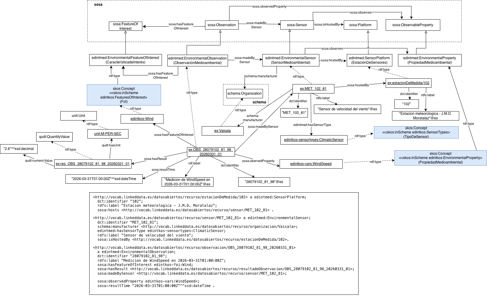

# Ontología EDINT de Sensores Medioambientales, caso Climatología (EDINT Environmental Sensors Ontology)

Este repositorio contiene ejemplos de uso concretos de la ontología de Sensores Medioambientales para el caso de magnitudes climatológicas.

Ver también: [Ontología EDINT de Sensores Medioambientales](https://github.com/EDINT-Ontologia/edint-ontologia-medio-ambiente)

## Estructura del repositorio (Repository structure)

| Folder | Description |
|--------|--------------|
| **examples/** | Incluye ejemplos que demuestran cómo instanciar o aplicar la ontología en escenarios de datos reales. |
| **mappings/** | Incluye mappings RML que ejemplifican la transformación de orígenes de datos en datos enlazados. |
| **diagrams/** | Contiene el diagrama con instancias relacionadas a los conceptos de la Ontología de Sensores Medioambientales.  |

# Diagrama con ejemplo de Calidad del Aire (Diagram with an Air Quality Example)
## Ejemplo de utilización de la Ontología de Sensores Medioambientales para Calidad del Aire 

Este ejemplo ilustra la utilización de la Ontología de Sensores Medioambientales para el dominio de Climatología. De esta manera se tiene una estación metereológica con identificador "102" que es una instancia de `edintmed:SensorPlatform`. Esta estación tiene un `edintmed:environmentalSensor` con identificador "MET_102_81" que es un sensor para velocidad del viento que está `sosa:hostedBy` (alojado por) la estación. Su tipo dentro de la taxonomía SKOS de `kos:SensorTypes` es "ClimaticSensor". Note que la ontología de sensores medioambientales contempla que la estación sea subclase de `geosparql:Feature`, por lo cual se pueden representar sus datos geoespaciales.

El sensor tiene como `schema:manufacturer`(fabricante) a la empresa "Vaisala". En la figura se representa una observación de velocidad del viento que es una instancia de `edintmed:EnvironmentalObservation`. Es decir que la propiedad `sosa:observedProperty` (propiedad observada) enlaza a la observación con un `edintmed:EnvironmentalProperty`, en este caso "WindSpeed", valor que pertenece a la taxonomía SKOS de `kos:EnvironmentalProperty`. 

La observación `sosa:hasFeatureOfInterest`(tiene una característica de interés) que se mide, en este caso "Wind" y que pertenece a una taxonomía SKOS de `kos:FeaturesOfInterest`. La observación `sosa:hasResult`(tiene un valor de resultado) que enlaza con una instancia de `qudt:QuantityValue` que a su vez `qudt:hasNumericValue`(tiene un valor numérico) de "2.6" en una unidad que es "unit:M-PER-SEC", la cual es una instancia de `unit:Unit`y que refleja una velocidad del viento expresada en metros por segundo. 

## Mantenimiento y evolución (Maintenance and evolution)

Para manejar las incidencias o mejoras sugeridas con respecto a la ontología, recomendamos seguir las guías proporcionadas en ([Issues Management](./ISSUES.md)) para generar una incidencia.

## Financiación (Funding)

Esta ontología ha sido desarrollada en el contexto del Espacio de Datos para las Infraestructuras Urbanas Inteligentes ([EDINT](https://edint.es)).

